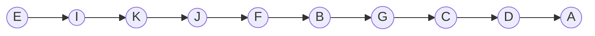
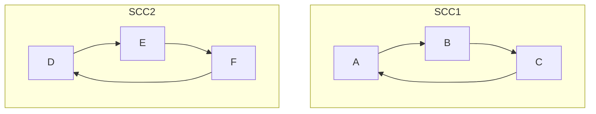
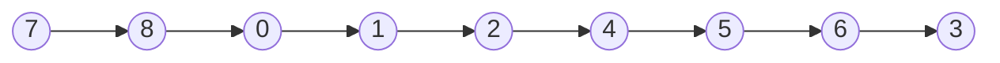

## Introduction
Graph connectivity is a fundamental concept in graph theory that explores the relationships and connectedness within a graph. In various real-world scenarios, understanding how elements are interconnected can reveal valuable insights. Several algorithms have been developed to study and analyze graph connectivity, each serving a unique purpose. In this discussion, we will delve into three prominent algorithms: Depth-First Search (DFS), Topological Sorting, and Strongly Connected Components (SCCs) using two DFS traversals, along with Breadth-First Search (BFS).

# DFS
Depth-first search is an algorithm for traversing or searching tree or graph data structures. The algorithm starts at the root node (selecting some arbitrary node as the root node in the case of a graph) and explores as far as possible along each branch before backtracking.

![[Pasted image 20240114134622.png]]

Using DFS in lexicography order starting from s
1. S --> W
2. W --> T (lexicography order)
3. T --> U (lexicography order)
4. U --> Y (lexicography order)
5.  Nowhere to go 
6. Backtrack the edges until we find a path that we can go (don't close the node that as a connection)
7. T --> X
8. backtrack until s no more path start in lexicography order in the remaining
9. r --> v
10. backtrack
11. END

|  | r | s | t | u | v | w | x | y |
| ---- | ---- | ---- | ---- | ---- | ---- | ---- | ---- | ---- |
| d | 13 | 1 | 3 | 4 | 14 | 2 | 8 | 5 |
| f | 16 | 12 | 10 | 7 | 15 | 11 | 9 | 6 |

# Topological Order
Topological order is a linear ordering of the vertices in a directed acyclic graph (DAG) such that for every directed edge **uv** from vertex **u** to vertex **v**, **u** comes before v in the ordering. In simpler terms, it's a sequence of vertices where each vertex comes before all the vertices to which it has outgoing edges.
**Linux Packages**
To do topological sort u need order by the final discovery value after a DFS.

![[Pasted image 20240114141719.png]]

|  | A | B | C | D | E | F | G | H | I | J | K |
| ---- | ---- | ---- | ---- | ---- | ---- | ---- | ---- | ---- | ---- | ---- | ---- |
| d | 1 | 2 | 14 | 18 | 3 | 5 | 15 | 19 | 6 | 8 | 9 |
| f | 22 | 13 | 17 | 21 | 4 | 12 | 16 | 20 | 7 | 11 | 10 |
E,I,K,J,F,B,G,C,H,D,A

# SCCs
  
SCCs, or Strongly Connected Components, are subsets of vertices in a directed graph where each vertex is reachable from every other vertex in the same subset. In other words, SCCs represent groups of vertices that have mutual reachability.

Example of SCCs

Now let's explain how to detect SCCs first do a DFS

![[Pasted image 20240114150941.png]] 

First of all let's do a DFS starting from 0

|  | 0 | 1 | 2 | 3 | 4 | 5 | 6 | 7 | 8 |
| ---- | ---- | ---- | ---- | ---- | ---- | ---- | ---- | ---- | ---- |
| d | 1 | 2 | 3 | 4 | 6 | 7 | 8 | 15 | 16 |
| f | 14 | 13 | 12 | 5 | 11 | 10 | 9 | 18 | 17 |
Now let's do the Transposed Graph

![[Pasted image 20240114151337.png]] 

Now let's see iterate the graph from Topological Order

Now let's see the SCCs
1. 7 There's no connection so it's ok
2. 8 There's no connection so it's ok
3. 0-3-2-1 They are SCCs
4. 4-5-6 They are SCCs too
So the SCCs are 0->3->2->1 and 4->5->6

# BFS
  
Breadth-First Search (BFS) is a graph traversal algorithm that explores all the vertices at the current level before moving on to the vertices at the next level. It starts at a given source node and explores its neighbors before moving to the next level of neighbors.

![[Pasted image 20240114162005.png]]

We will start the traverse in A
We start in a node and add +1 to the distance that the node can see and put the parent on the nodes that they can see

|  | A | B | C | D | E | F | G | H |
| ---- | ---- | ---- | ---- | ---- | ---- | ---- | ---- | ---- |
| d | 0 | 1 | 2 | 1 | 2 | 2 | 3 | 4 |
| pi | - | A | B | A | D | D | F | G |
