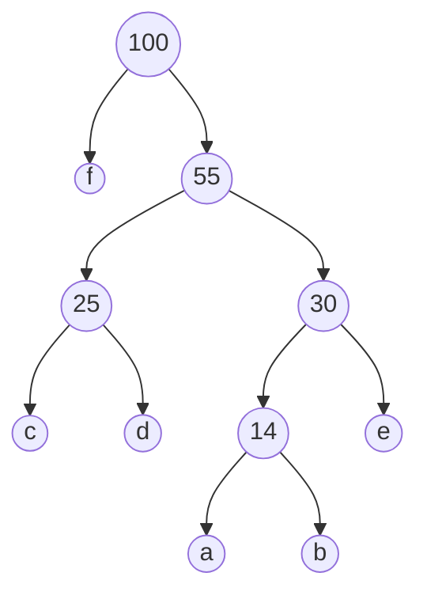

## Introduction
Greedy programming, or greedy algorithms, is a paradigm in computer science where the optimal solution to a problem is constructed incrementally by making locally optimal choices at each stage. The key characteristic of greedy algorithms is that they make the best possible decision at each step without reconsidering previous choices. While this approach does not guarantee a globally optimal solution in every case, it often leads to efficient solutions for certain types of problems.

### Huffman Encoding
  
Huffman encoding is a popular and widely used algorithm for lossless data compression. The primary goal of Huffman encoding is to efficiently represent data by assigning variable-length codes to input characters, with shorter codes assigned to more frequent characters.

***Input:*** 

| a | b | c | d | e | f |
| ---- | ---- | ---- | ---- | ---- | ---- |
| 5 | 9 | 12 | 13 | 16 | 45 |

***Output:*** 4  

| a | b | c | d | e | f |
| ---- | ---- | ---- | ---- | ---- | ---- |
| 1100 | 1101 | 100 | 101 | 111 | 0 |

**Explanation**
First of all the algorithm will sort a the list that they gave us in this case it doesn't need to be sorted then it will sum the two lowest values

Now to find the values is just put 0 and 1 in each node in the question it will say if u should put the 0 on right or left.
#### Important !
Don't forget that the smaller nodes are on the left and the bigger ones of the right!

### Activity Selection
  
**Landing Sequencing at the Airport Runway**

Consider the challenge of planning the landing schedule for a set of flights at an airport runway during a specific hour of the day. Each flight i occupies the runway from its scheduled landing time, ai, until the landing procedure is completed, which lasts for a duration given by di. The runway becomes available again immediately after the completion of the landing procedure.

**Objective:** Determine the optimal sequence for flight landings on the runway to maximize the total number of landings during the specified one-hour period.

**Approach:** To solve this problem efficiently, you are tasked with employing a greedy algorithm. A greedy approach involves making locally optimal choices at each step, with the hope that these choices will lead to a globally optimal solution.

***Input1***

| i | 1 | 2 | 3 | 4 | 5 | 6 | 7 | 8 | 9 | 10 | 11 | 12 | 13 | 14 | 15 | 16 | 17 |
| ---- | ---- | ---- | ---- | ---- | ---- | ---- | ---- | ---- | ---- | ---- | ---- | ---- | ---- | ---- | ---- | ---- | ---- |
| ai | 00 | 06 | 10 | 13 | 17 | 20 | 23 | 25 | 28 | 31 | 33 | 36 | 39 | 40 | 43 | 50 | 53 |
| di | 5 | 5 | 3 | 6 | 1 | 3 | 2 | 6 | 2 | 4 | 5 | 3 | 5 | 2 | 4 | 6 | 2 |

***Output***

| 1 | 2 | 3 | 4 | 5 | 6 | 7 | 8 | 9 | 10 | 11 | 12 | 13 | 14 | 15 | 16 | 17 |
| ---- | ---- | ---- | ---- | ---- | ---- | ---- | ---- | ---- | ---- | ---- | ---- | ---- | ---- | ---- | ---- | ---- |
| X | X |  |  | X | X | X |  | X | X |  | X |  | X | X |  | X |

***Explanation***
We order in in the sum then we choose the first one and if we can't we pass to another

| i | 1 | 2 | 3 | 5 | 4 | 6 | 7 | 9 | 8 | 10 | 11 | 12 | 14 | 13 | 15 | 17 | 16 |
| ---- | ---- | ---- | ---- | ---- | ---- | ---- | ---- | ---- | ---- | ---- | ---- | ---- | ---- | ---- | ---- | ---- | ---- |
| ai | 00 | 06 | 10 | 17 | 13 | 20 | 23 | 28 | 25 | 31 | 33 | 36 | 40 | 39 | 43 | 53 | 50 |
| di | 5 | 5 | 3 | 1 | 6 | 3 | 2 | 2 | 6 | 4 | 5 | 3 | 2 | 5 | 4 | 2 | 6 |
| sum | 5 | 11 | 13 | 18 | 19 | 23 | 25 | 30 | 31 | 35 | 38 | 39 | 42 | 44 | 47 | 55 | 56 |
| Choosing | X | X | - | X | - | x | x | X | - | X | - | X | X | - | X | X | - |