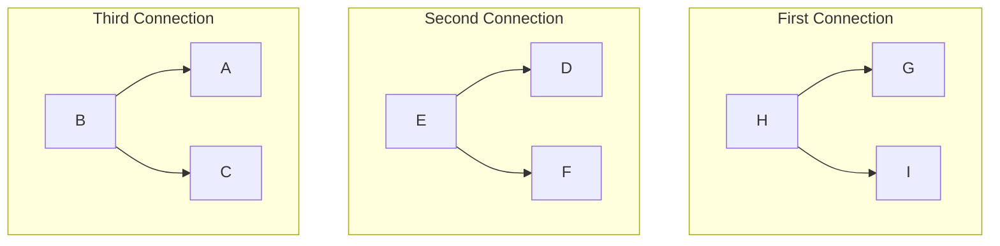
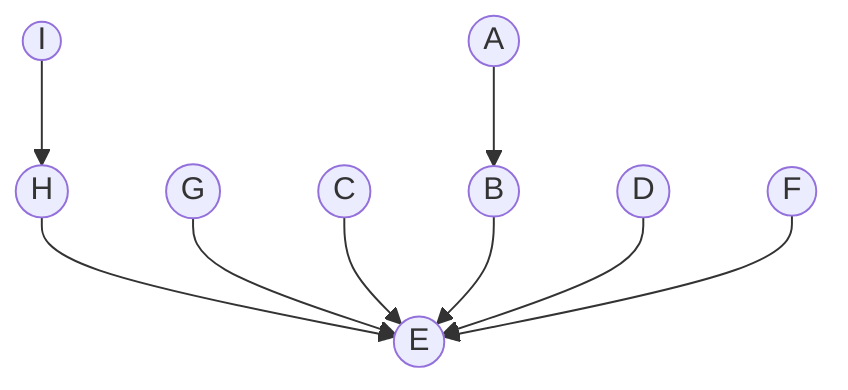

A Minimum Spanning Tree is a tree that spans all the vertices in a connected, undirected graph while minimizing the total sum of edge weights. Here are key concepts related to MSTs

## Kruskal
Kruskal's Algorithm is a widely-used algorithm in graph theory for finding the Minimum Spanning Tree (MST) of a connected, undirected graph. MSTs are crucial in network design, circuit design, and various other applications where one seeks to connect a set of nodes with the minimum possible total edge weight.

![[Pasted image 20240114194143.png]]

First of all we sort the edges by weight and where there is a tie we do in lexicography order
(G-H);(G-I);(H-I);(D-E);(D-F);(E-F);(A-B);(A-C);(B-C);(C-F);(C-G);(F-G)

## Prim
Prim's Algorithm is a greedy algorithm that starts with an arbitrary vertex and grows the Minimum Spanning Tree incrementally by adding the smallest-weight edges that connect a vertex in the tree to a vertex outside the tree. The process continues until all vertices are included in the MST.

![[Pasted image 20240114192423.png]]

First of all we will start from the A vertice and choosing the least weight edge then do that until we have all vertices

|  | A | B | C | D | E | F | G |
| ---- | ---- | ---- | ---- | ---- | ---- | ---- | ---- |
| key | 0 | 1 | 8 | 1 | 5 | 1 | 2 |
| pi | Nil | A | B | A | C | E | E |
**Peso total da MST**: 1+8+1+5+1+2
Números de MSTs: $$ 2*3*2=12$$

